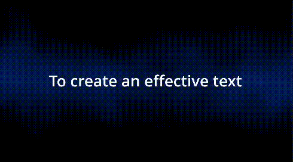
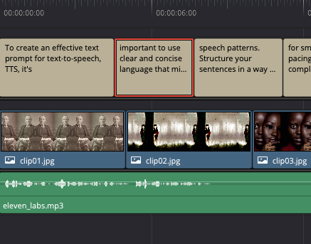

### Description

You have audio and you want subtitles or centered text to help the reader read along the narration. Either your audio is a voice recording or speech-to-text (Hint if you are creating faceless youtube videos at mass).

You can generate subtitles from your audio clip in the media pool. On the free DaVinci, you do NOT have audio transcription feature (Box select -> Right click -> Audio Transcription). If you're on the free version, you can use my script at `subtitle_from_audio/generate.py` to generate a SRT subtitle file.

Regardless of how you obtained your SRT file, you can use it to create a traditional subtitle track or use it to create Text+ clips. There are two flavors of Text+ clips that will be discussed in the instructions.

## Installation of SRT generator

To install the required package, run:

```
pip install openai-whisper torch
```

Make sure ffmpeg is installed on your machine. You can google installation instructions for ffmpeg on your particular OS.

## Usage of SRT generator

You can choose the model and device to use in the `chosen_processor.py` file.

| Size      | Parameters | English-only | Multilingual |
|-----------|------------|--------------|--------------|
| tiny      | 39 M       | ✓            | ✓            |
| base      | 74 M       | ✓            | ✓            |
| small     | 244 M      | ✓            | ✓            |
| medium    | 769 M      | ✓            | ✓            |
| large     | 1550 M     | x            | ✓            |
| large-v2  | 1550 M     | x            | ✓            |

Then add where the wav or mp3 file with speech is at. Then add where you want to save the SRT file to. For example, adjust in `transcribe_audio/generate.py`:

```
INPUT_AUDIO="eleven_labs.mp3"
OUTPUT_DIR="./" # Eg. ./
OUTPUT_FILENAME_W_EXT="eleven_labs.srt"
```

Adjust `subtitle_from_audio/generate.py` to transcribe the audio wav or mp3 file into a subtitle SRT file. You may adjust the script's srt output path but is not recommended because the Text+ generator at `drop_textp.py` if you choose to use it, would need its SRT path adjusted.

Finally, you may adjust `max_line_count` and `max_line_width`. If you will use the SRT file to create Text+ clips, your width is limited between 30 and 35 unless you change the font and/or font size of the Text+ clip template (to be discussed later). If you will use the traditional subtitle track instead of Text+ track clips generation, you are not really limited on the width.

Generate the SRT with this:
```bash
python generate.py
```

## Use SRT Subtitle File

### Option A: Create synced subtitle track

Look for the srt file in the output folder you've set in the script. You can drop this subtitle file (default named `drop_subtitle_media.srt`) into your media pool, then create a Subtitle track in your timeline, then lastly drop the SRT from the media pool into that track.

Subtitle track does not support transitions, custom font styles, and character level styling. If you want these options, go with Option B for Text+ clips generation.

### Option B: Create Text+ clips on an empty video track

If instead of using a subtitle track, you want to generate Text+ clips across an empty video track so that it can follow IG-styled middle of the screen text. There are two major phases to create this track. 

- First, you need to prep your project so there's a Text+ clip in the media pool whose font settings will be used as a basis to create those Text+ clips into the video traack. Also you need an empty video track. 
- Second, after adjusting `drop_textp.py`, you will need to drop the script into the DaVinci console. 

1. Look into the Effects panel (top left panel), and search for "Text". Drag the "Text+" into any area on a video track. Then drag that "Text+" clip from the video track into the media pool. Now delete the timeline's "Text+" clip. You now have the "Text+" clip in the media pool and no "Text+" clip from this exercise in the timeline. Finally, adjust any font settings at the media pool's Text+ clip because this will be the template used to generate the Text+ subtitle clips into the timeline.

- Add stroke/outline to your text? Refer to my tutorial at [DaVinci Text Plus - Stroke or edge on text](wengindustries.com/app/3dbrain/?open=DaVinci%20Text%20Plus%20-%20Stroke%20or%20edge%20on%20text.md)

2. Choose between the styles of Text+ clip generator. The style you choose will be the corresponding script that you're adjusting and running.

- Static Text+ Clips (`drop_textp_static.py`): An entire subtitle cue (SRT file with contents grouped with numbers 1, 2, 3, etc are each a subtitle cue) appears on the screen when those words are being spoken.



- Accumulating Text+ Clips (`drop_textp_accum.py`): Each time a word is said, the word accumulates on the screen until that subtitle cue is finished. On the next subtitle cue, the process starts all over with the first word.


3. After choosing a style of Text+, then adjust the `drop_textp_static.py` or `drop_textp_accum.py`: 
- See if you need to adjust the path to the SRT file
- See if you need to adjust SCRIPT_DIR which is the absolute path to the  `drop_textp_static.py` or `drop_textp_accum.py`.
Explanation: This is needed because the free DaVinci Resolve does not expose the script's path when drag and dropping into a console, which is needed for the code
- See if for your current project, you have an empty video track 2. If not, you have to adjust the number at TARGET_EMPTY_VIDEO_TRACK. You are required to have an empty video track for the Text+ clips to insert into from the first frame.
- See if you want to adjust TRANSFORM_EACH_TEXTP if you want uppercasing presets to run on each Text+ clip. Some uppercasing presets include uppercasing the first word of each Text+ clip, or uppercasing all words.

4. Once you are done adjusting `drop_textp_static.py` or `drop_textp_accum.py`, go ahead and drag and drop the script into the DaVinci console. On success, you will see Text+ clips fill the empty video track and those Text+ clips will have the subtitle that sync with the audio. 

Next you may decide to spice up the Text+ subtitle clips a bit:
- Add stroke/outline to your text? You might have wanted to do that to the template Text+ clip in the media pool before running the track Text+ generator script, so that all track Text+ clips have the stroke/outline. If that's not the case and you just need a specific Text+ clip to have stroke/outlines: Refer to my tutorial at [DaVinci Text Plus - Stroke or edge on text](wengindustries.com/app/3dbrain/?open=DaVinci%20Text%20Plus%20-%20Stroke%20or%20edge%20on%20text.md)
- Transitions for the Text+ clips? You can choose to add transitions or copy the same transitions from the main track. You can use OPT drag on Mac to duplicate transitions between clips on the same track or on different tracks.
- Character level styling? As in you want specific characters in a different style? Refer to my tutorial at [DaVinci Text Plus - Edit specific character style in Text Plus](https://wengindustries.com/app/3dbrain/?open=DaVinci%20Text%20Plus%20-%20Edit%20specific%20character%20style%20in%20Text%20Plus.md)

## Some video editing required

Depending on edge cases, you may find some gap between Text+ clips on the track. This should be minimum. But if you find gaps, go ahead and multi-select and close up the gaps. In the future, the algorithm will be improved to cover more cases.

You may find that by chance your subtitle could end or start too soon from another video clip starting or ending. This would be jarring. So adjust the video clips as needed.



## FAQs

Q: I have different Text+ clips and I would like to copy the style of another Text+ clip to a specific generated Text+ clip in the video track
A: As of 9/2024 that is currently not possible without scripting. Even right clicking for pasting specific attributes does not have the Text formatting options to paste over. See:
https://forum.blackmagicdesign.com/viewtopic.php?f=21&t=162862

I may consider implementing the ability to choose from different Text+ clips as templates for different track Text+ clips, but this is practically impossible without a UI UX, and currently we are running individual scripts for the most part because the free DaVinci Resolve limits you from running external scripts or streamlining the scripts.